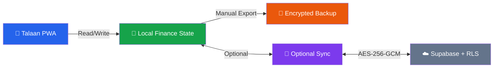

# 💰 Talaan · V2.5.0

<div align="center">


**A local-first personal and household finance PWA built for privacy, resilience, and everyday use.**

[](https://github.com/nyxdcz/talaan/actions/workflows/quality-pages.yml)


[🚀 Get Started](#quick-start) · [📚 Documentation](#documentation) · [🛠️ Contribute](#contributing) · [🔒 Security](#privacy-and-security)

</div>

---

## 🎯 What is Talaan?

Talaan is a **finance-first PWA** designed for people who value **privacy, control, and reliability**. Whether you're managing personal expenses or shared household finances, Talaan keeps your data local, encrypted, and always accessible—even offline.

### Why Talaan?

- ✨ **Privacy-first**: Your financial data stays on your device. Cloud sync is optional and encrypted end-to-end.
- 🏠 **Works offline**: Full functionality without internet. Sync when ready.
- 👥 **Household-ready**: Share expenses, track who paid what, and settle debts without double-counting.
- 📊 **Smart insights**: Monthly reports, budget forecasts, savings tracking, and trend analysis.
- 🔄 **Recoverable**: Every change is auditable. Undo/redo for peace of mind.
- ⚡ **Fast & responsive**: Runs on any device with a modern browser.

---

## ✨ Features at a Glance

| Capability | What it means |
|---|---|
| 🗂️ **Account Ledger** | Transfers, reconciliations, direct spending, and auditable balances. |
| 💡 **Budget & Insights** | Monthly planning, forecasts, savings goals, and financial reports. |
| 👨‍👩‍👧‍👦 **Household Splits** | Share expenses with groups, track who paid, and settle debts fairly. |
| 🏢 **Projects & Productivity** | Kanban workflow, Quick Add, search, filters, reminders, and undo/redo. |
| 🤝 **Payees & Rules** | Normalize payee names, preview auto-categorization before applying. |
| 📥 **Statement Import** | Parse CSV, OFX, and QIF files. Map, preview, deduplicate—all locally. |
| 💎 **Net Worth Tracking** | Monitor assets, liabilities, and wealth composition over time. |
| 🔐 **Encrypted Sync** | Multi-device sync with AES-256-GCM encryption (Supabase-compatible). |
| 📱 **Offline PWA** | Install as an app. Works perfectly without internet. |
| 🛡️ **Data Protection** | Finance schema, cache, and sync behavior are protected contracts. |

---

## 🚀 Quick Start

### Prerequisites
- **Node.js** 22 or newer
- **npm** (included with Node.js)

### Setup

```bash
# Clone the repository
git clone https://github.com/nyxdcz/talaan.git
cd talaan

# Install dependencies
npm ci --ignore-scripts --no-audit --no-fund

# Start development server
npm run dev
```

Open **http://localhost:3000** in your browser. The app loads with sample data so you can explore immediately.

For detailed setup guidance, configuration, and deployment options, see [📖 Setup Docs](docs/setup/).

---

## 🏗️ How Talaan Works



**The Flow:**
1. All your data lives **locally** on your device by default
2. Export to **encrypted backup** anytime for safety
3. Optionally enable **cloud sync** to access the same data across devices
4. Changes encrypt end-to-end before leaving your device

---

## 🧪 Quality & Testing

Talaan runs **regression tests** across multiple dimensions to keep data integrity, feature correctness, and privacy rock-solid:

```bash
# Run full quality suite (linting + unit tests + regressions)
npm run quality

# Run only source regressions
npm test

# Run specific test suites
npm run test:finance       # Finance calculations and workflows
npm run test:regression    # UI and release contracts
npm run test:sync          # Cloud sync behavior

# Install and run browser tests
npx playwright install chromium
npm run test:browser       # End-to-end privacy and accessibility
```

**Test Organization:**
- `tests/browser/` — Playwright end-to-end behavior, accessibility, and privacy
- `tests/finance/` — Finance workflows, calculations, and UI contracts
- `tests/regression/` — Release and UI regression contracts
- `tests/security/` — Privacy, import, and security behavior
- `tests/sync/` — Cloud and multi-device synchronization
- `tests/helpers/` — Repository inspection and maintenance utilities

For detailed test information, see [🧪 Tests](tests/README.md).

---

## 📚 Documentation

| Guide | Purpose |
|-------|---------|
| **[Setup & Configuration](docs/setup/)** | Local dev, hosting, cloud setup |
| **[Architecture](docs/architecture/)** | Repository structure, module ownership, organization rules |
| **[Migrations](docs/migration/)** | Data and schema migration notes |
| **[Release Ops](docs/release/)** | Release-specific deployment documentation |
| **[Changelog](CHANGELOG.md)** | Complete history of releases and changes |
| **[Contributing](CONTRIBUTING.md)** | How to contribute code and follow standards |

---

## 🔒 Privacy and Security

Talaan puts **your privacy first**:

### Local-First by Design
- ✅ Your financial data never leaves your device unless you opt in to cloud sync
- ✅ All processing happens in your browser—no server-side logic touches your finances
- ✅ Backup and restore entirely offline

### Encrypted Sync (Optional)
- ✅ Cloud sync uses **AES-256-GCM encryption** with client-side keys
- ✅ Only publishable/anonymous Supabase credentials are stored in the browser (never service keys)
- ✅ Sync can be toggled on/off anytime—your local data is unaffected

### Data Protection
- ✅ Payment correctness and account balances are protected contracts
- ✅ No silent rewrites of financial records or paid status
- ✅ Every change is auditable and reversible (via Undo)
- ✅ Recovery safeguards are never removed for convenience

For complete details, see [🔐 Security Policy](SECURITY.md) and [📋 Privacy Policy](PRIVACY.md).

---

## 🤝 Contributing

We welcome contributions! Here's how to get started:

1. **Read [CONTRIBUTING.md](CONTRIBUTING.md)** for workflow and standards
2. **Create a focused branch** (e.g., `feat/budget-export`, `refactor/sync-logic`)
3. **Write clear commit messages** using Conventional Commits
4. **Run quality checks before opening a PR:**
   ```bash
   npm run quality
   npm run test:browser
   ```
5. **Open a PR** with a descriptive Conventional Commit title
6. **Wait for checks to pass** (repository validation, linting, browser tests, audit)

### Key Guidelines
- Keep changes **focused and minimal**
- Preserve **data compatibility** and installed PWA safety
- Update `version.json`, `CHANGELOG.md`, and runtime metadata when behavior changes
- Run **full quality suite** before proposing changes
- Add regression tests for new finance features

See [CONTRIBUTING.md](CONTRIBUTING.md) for complete details.

---

## 📦 Current Release

| Metric | Value |
|--------|-------|
| **Version** | V2.5.0 |
| **Finance Schema** | 12 |
| **Cloud Schema** | V3 |
| **Sync Interval** | 5 minutes |
| **Status** | ✅ Production |

### What's New in V2.5.0

**Household Expense Splits**
- Organize shared expenses into groups with custom names
- Support for equal, percentage, and exact amount splits
- Track who paid and who owes—without double-counting in personal reports
- Explicit settlement history with recovery snapshots

See [📋 Changelog](CHANGELOG.md) for complete release history.

---

## 🏃 Repository Structure

```
talaan/
├── 📁 assets/               Application code and styles
│   ├── css/                 Component and feature styles
│   ├── js/                  Finance, sync, UI, and feature modules
│   └── mascots/             Dashboard mascot artwork
├── 📁 docs/                 User and developer documentation
│   ├── architecture/        Repository organization and rules
│   ├── setup/               Setup and configuration guides
│   ├── migration/           Data migration notes
│   └── release/             Release-specific operational docs
├── 📁 icons/                Runtime app icons
├── 📁 scripts/              Build, audit, and setup helpers
├── 📁 supabase/             Database schema, RLS policies, Edge Functions
├── 📁 tests/                Browser, finance, regression, security, sync tests
├── 📁 vendor/               Vendored browser dependencies
├── 📄 index.html            Application shell
├── 📄 sw.js                 Service worker for offline support
├── 📄 manifest.webmanifest  PWA manifest
└── 📄 version.json          Release metadata
```

For detailed ownership and organization rules, see [🏗️ Architecture](docs/architecture/README.md).

---

## 🎨 Tech Stack

- **Language:** JavaScript (ES2022+), HTML5, CSS3
- **Runtime:** Node.js 22+
- **Framework:** Vanilla JS (no external UI frameworks)
- **Testing:** Playwright (browser), custom Node.js (unit/regression)
- **Linting:** ESLint 10+
- **Optional Cloud:** Supabase (PostgreSQL + RLS + Edge Functions)
- **PWA:** Service Workers, IndexedDB, Web Workers

---

## 📞 Support & Feedback

- 🐛 **Found a bug?** Open an [issue](https://github.com/nyxdcz/talaan/issues)
- 💡 **Have a feature idea?** Share it in [discussions](https://github.com/nyxdcz/talaan/discussions)
- 📖 **Need help?** Check the [documentation](docs/) or [setup guide](docs/setup/)

---

## 📜 License

This project is public and open source. See the repository for license details.

---

<div align="center">

**Built with ❤️ for privacy-conscious people who value control over their finances.**

[⬆ Back to top](#-talaan--v250)

</div>
